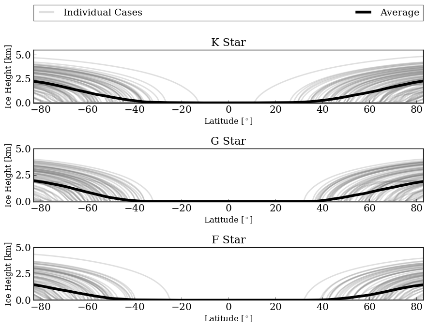

# Cap Height Plot

This figure shows the range and average ice heights of ice caps as a function of latitude for stars orbiting F (top), G (middle) and K (bottom) dwarf stars. Light grey curves show 100 randomly selected individual simulations, while black shows the average of all simulations that concluded with an ice belt. Although the averages are all symmetric about the poles, some individual ice caps are significantly displaced.

.. note:: 

    These instructions assume you have completed the [Dynamic Cases](../DynamicCases) and have build the bigplanet archive.

This plot uses a bigplanet filtered file. To generate this file, type the following in each of spectral type folders in the _DynamicCases/CaseA/_ folder:

```
bigplanet bpl.in
```

That will generate a file called _Test.bpf_. Once that has completed,  generate the plot with the following command in this directory:

```
python makeplot.py <pdf | png>
```

where the two arguments after makeplot.py set the output to either a pdf or png. This should generate the plot:



.. note::

    The exact values in your reproduction may vary slightly (1%) due to differences in random number generation.