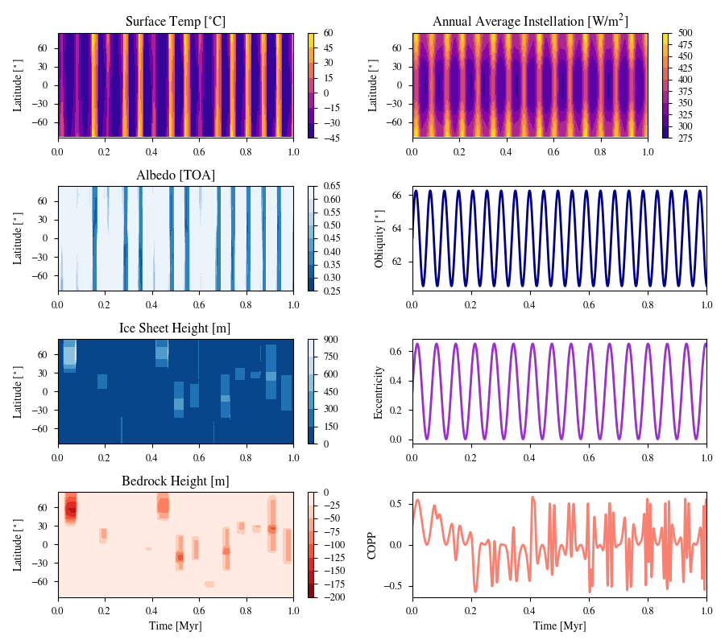

# Chaotic Example

This plot shows a simulation in which a planet orbiting an F dwarf star evolves chaotically, with epochs of both equitorial and polar ice.

#### _These instructions assume you have completed the [Dynamic Cases](../DynamicCases) and have built the bigplanet archive._

Below is a table of inital values for the case:

| Parameter              | Initial Value |
| ---------------------- | ------------- |
| Instellation           | 0.9953        |
| Obliquity              | 63.39         |
| Obliquity Amplitude    | 5.743         |
| Obliquity Period       | 48192         |
| Eccentricity           | 0.326         |
| Eccentricity Amplitude | 0.650         |
| Eccentricity Period    | 65292         |

The first step is to extract the desired simulation's data from the raw data by running `bigplanet`:

```
bigplanet bpl.in
```

This command generates a ["bigplanet file"](https://virtualplanetarylaboratory.github.io/bigplanet/filetypes.html) called _ChaoticExample.bpf_ that contains only the data needed for this figure. To create the figure, execute the following command in the command line:

```
python makeplot.py <pdf | png>
```

where the two arguments after makeplot.py set the output to either a pdf or png. The resultant plot should should look like this:



_Top left:_ Surface temperature. _Top middle left:_ Top of atmosphere albedo. _Bottom middle left:_ Ice sheet height. _Bottom left:_ Bedrock depression (note the negative scale). _Top right:_ Annual average instellation. _Top middle right:_ Obliquity. _Bottom middle right:_ Eccentricity. _Bottom right:_ Climate obliquity precession parameter (COPP).

#### _Chaotic evolution depends sensitively on initial conditions, so unless you use the same hardware and software as the author, producing the same random numbers, your result could be very different. Qualitatively similar outcomes should be present in the [DynamicCases](../DynamicCases) data set._
