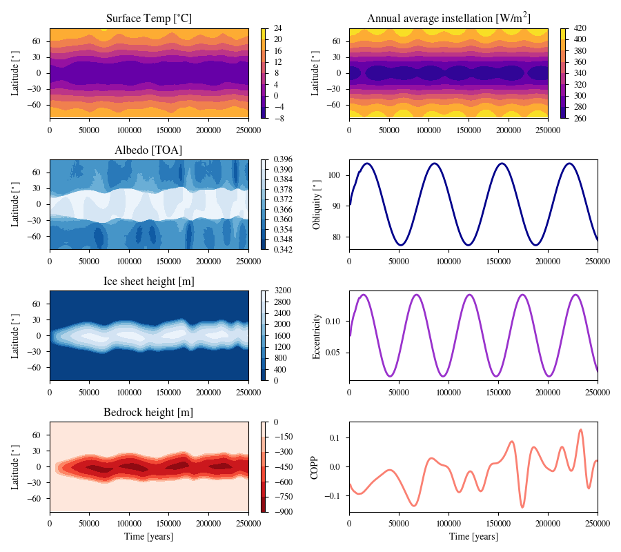

# Dynamic Evolution Example

This plot shows a stable Icebelt from the Dynamic Cases, specifically the Case A, G Dwarf. 

#### _These instructions assume you have completed the [Dynamic Cases](../DynamicCases) and have built the bigplanet archive._

Below is a table of inital values for the case:

| Parameter              | Initial Value |
| ---------------------- | ------------- |
| Instellation           | 0.9405        |
| Obliquity              | 90.5          |
| Obliquity Amplitude    | 26.5          |
| Obliquity Period       | 53,325        |
| Eccentricity           | 0.077         |
| Eccentricity Amplitude | 0.129         |
| Eccentricity Period    | 44656         |

The first step is to extract the desired simulation from the _archive file or raw data XXX_ by running ``bigplanet``: 
```
bigplanet bpl.in
```

This will generate a ["bigplanet file"](https://virtualplanetarylaboratory.github.io/bigplanet/filetypes.html) called _DynamicExample.bpf_

Now that we have all the data, run the following code in the command line:

```
python makeplot.py <pdf | png>
```

where the two arguments after makeplot.py set the output to either a pdf or png. This command will generate the following plot:



_Top left:_ Surface temperature. _Top middle left:_ Top of atmosphere albedo. _Bottom middle left:_ Ice sheet height. _Bottom left:_ Bedrock height (note the negative scale). _Top right:_ Annual average instellation. _Top middle right:_ Obliquity. _Bottom middle right:_ Eccentricity. _Bottom right:_ Climate obliquity precession parameter (COPP).

#### _Climate evolution depends sensitively on initial conditions, so unless you use the same hardware and software as the author, producing the same random numbers, your result could be quantitatively different._