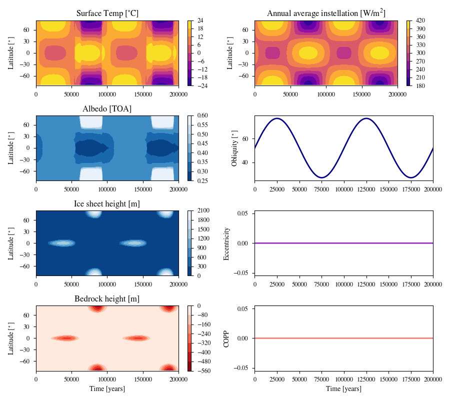

# Periodic Example

This plot shows a simulation in which the planet was oorbiting a G dwarf star, but the ice grown was periodic, resulting in seasonal ice growth on the polar caps and ice belts.

Below is a table of inital values for the case:

| Parameter           | Initial Value |
| ------------------- | ------------- |
| Instellation        | 0.9931        |
| Obliquity           | 52            |
| Obliquity Amplitude | 50            |
| Obliquity Period    | 100000        |
| Eccentricity        | 0             |

To generate the data and plot, run the following code in the command line:

```
vplanet vpl.in
python makeplot.py <pdf | png>
```

where the two arguments after makeplot.py set the output to either a pdf or png. This command will generate the following plot:



 _Top left:_ Surface temperature. _Top middle left:_ Top of atmosphere albedo. _Bottom middle left:_ Ice sheet height. _Bottom left:_ Bedrock height (note the negative scale). _Top right:_ Annual average instellation. _Top middle right:_ Obliquity. _Bottom middle right:_ Eccentricity. _Bottom right:_ Climate obliquity precession parameter (COPP).